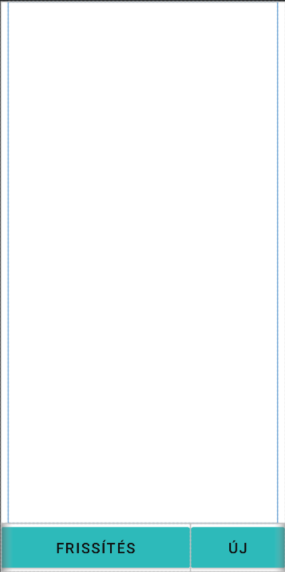
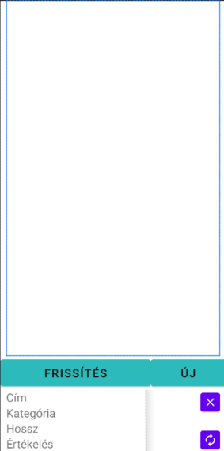
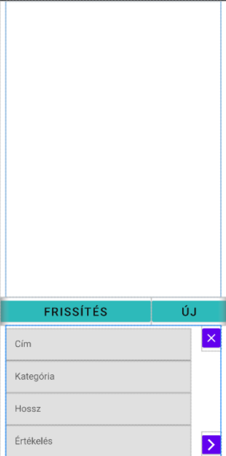

# Binding osztályok

A mai téma a Google Jetpack két nagyon jó funkciója, a `ViewBinding` és a `DataBinding` osztályok lesznek

> A csoportba feltöltöttem a BindingFullStarter repót, azt mindenki forkolja le, és nyissa meg a szerkesztőbe, addig is beszéljük át a témát.

* A bindingok használata egy új programozási stílus, ami elkerüli a "`boilerplate`" kódokat
* Boilerplate - ismétlődő, csak mert muszály kód (getterek/setterek és az iniciáló metódusok nagyja

## ViewBinding

A megírt *xml* resource-ból minden azonosítóval rendelkező elemhez egy **null-safe** hivatkozást csatol, amiket egy `activity` vagy `fragment` specifikus `binding` osztályba rendezi.

A binding az activity nevének és a binding szónak a camel-case formályából áll.

* Például az `activity_main.xml`-hez az `ActivityMainBinding` osztályt fogja rendelni.

Az *xml* frissítésével automatikusan újra generálódik, az egyszeri beállítás után nincs vele teendőnk.

Ez mit is jelent?

* Létrehozunk egy elemet
* Adunk neki egy azonosítót
* És máris elérhető a binding osztályban
  * nem kell iniciálni,
  * a típusa megegyezik az elem típusával.
* Később, ha megváltoztatjuk az elem típusát (pl egyszerű gombról áttérünk a google új `Materialbutton` osztályára) a binding azt is követi, és mentés után annak minden funkciója elérhető.
  * Nyilván ha textview-ból állunk átt button-re, akkor a metódusok hivatkozása lehet gond, de erre számíthatunk.

## DataBinding

Az *xml* forráshoz saját típusú változót rendelhetünk, és annak a paramétereit tudod az adott elemekhez rendelni. A generált binding változóihoz getter és setter lessz kapcsolva, amivel az összes elem tartalmát lehet automatikusan átírni.

> Mondjuk a majdani Film példával az egyik textView-hoz a film címét rendeljük, a másikhoz a kategóriát, és amikor a binding setFilm() metódusát hívjuk meg, az abban deffiniált film paramétereit leosztja az annak megfelelő textView-kba, de ezeket megnézzük majd élesben is.

A DataBinding magába foglalja a ViewBinding osztályt, így elég csak az egyiket beállítani a gradle fájlban.

### Importálás

> ```gradle
> android{
>    …
>     buildFeatures{
>         viewBinding true
>     }
>    …
> }
> ```

## Statisztika

Itt láthattok egy kis statisztikát az előző technológiák működéséről.

Ahogy látható, a `ViewBinding`-nak továbbra sincs kihatása a projekt buildelési idejébe, viszont a `DataBinding`-nak van, azt akkor érdemes importálni, ha tényleg használjuk, minden esetre a futási időre ennek sincs kihatása, tehát ez csak a fejlesztési szakaszban lehet kellemetlen. A Binding osztályok előtt volt még a `butterknife` és a `kotlin syntetics` osztály is, sajnos ezek nem voltak minden esetben **null-safe**-ek, a google azokat már nem fejleszti.

## Gradle

Remélem mostanra mindenkinek sikerült forkolni a repót, lépjünk is be az app gradle-be, és adjuk hozzá a view binding-ot a projekthez.

Ha mindenki megvolt, szinkronizáljuk  a projektet a frissített gradle-el, ha valamit elgépeltünk, akkor láthatjuk karácsonyi fényeket mondván, hogy a build sikertelen.

Ha sikerült, akkor megvagyunk a setuppal, már csak az `onCreate()` metódusban kell varázsolni.

## onCreate()

Lépjünk be a `MainActivity`-be, láthatjuk, hogy van már egy előre elkészített keret, most órán életre is keltjük ezt. A design három nézetet különít meg.

Az alap megjelenésben csak a vezérlő gombok, és egy ScrollView látható, ha egy filmre koppintunk, megjelenik egy nézegető a vezérlőbombok alatt, ha pedig a szerkesztő vagy új gombra nyomunk, egy beviteli panel jelenik meg a nézegető helyén.
| Alap megjelenés                                      | Nézegető nézet                                      | Szerkesztő / Készítő nézet                        |
| ------------------------------------------------------- | -------------------------------------------------------- | -------------------------------------------------------- |
|  |  |  |

Változtatások
| Scope    | tartalom                                                      |
| ---------- | --------------------------------------------------------------- |
| class    | *Törlés                                                     |
| class    | `ActivityMainBinding binding;`                                |
| onCreate | `binding = ActivityMainBinding.inflate(getLayoutInflater());` |
| class    | *Minden hivatkozás javítása (+`binding.`)                  |
| init     | *Törlés                                                     |
